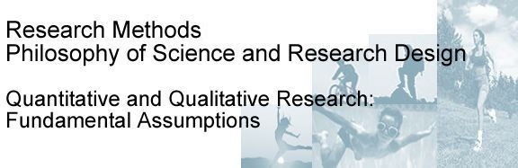
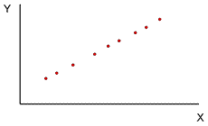
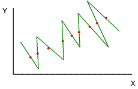

在这里，我们研究定量和定性研究之间的差异，并进一步探索科学的本质及其潜在的哲学假设。 请注意，我们只是在这里抓住这些问题的表面！ 这些是科学哲学家数百年来一直在辩论的东西，毫无疑问，这些东西将持续数百年。 我们的目的只要有对这些有一个感觉就足够了。

## 定量研究与定性研究  **Quantitative versus qualitative research**

大多数体育，健康和运动科学研究，如人类，行为和社会科学研究一般，采用自然科学几个世纪以来发展起来的方法。然而，当这种方法用于行为和社会领域时存在很多争议。这个辩论往往是在定性和定量研究之间的区别。

定量研究者广泛接受自然科学的假设和方法。他们量化感兴趣的变量（将他们变成数字），并用数学方法检查变量之间的关系（使用统计学）。定量研究一般采用演绎的方法来推理：假设是基于理论发展的，然后收集数据来检验假设。所以它从理论转向数据。量化研究一般都是规范性的：关注点在于泛化，致力于普遍性陈述或规范的发展。因此，收集的数据往往是在个体之间进行汇总（例如比较群体平均数）。

另一方面，定性研究者则拒绝了自然科学的假设和方法可以应用于行为和社会科学的观点。他们认为，人是各自独特的个体，人类社会交往的复杂性不能简单地归结为数字。相反，他们的目的是发现和报告我们生活的社会世界的质量( **quality**)。定性研究通常采用一种归纳的方法来进行推理：观察（收集数据），然后试图将其发现的理论整合起来。所以它从数据转向理论。它的方法通常是具体的：关注点是个性和独特性。因此，定性研究收集的数据倾向于个人和案例研究。

定量研究的倡导者和那些赞成定性研究的研究者之间的争论往往变得激烈和尖刻，几乎到了每一方都被简化为纯粹的名义调用的地步。一些定性研究人员将定量研究人员称为“quantoids”，提出了机械的，机器人的研究方法。当然，双方往往都是搞对方不公平和不切实际的漫画。

为了在体育和运动科学背景下就这些问题进行更为合理的辩论，值得阅读劳伦斯洛克，罗伯特舒茨和达里尔赛德普的关于1989年“运动与运动研究季刊”中发表的定性研究论文的三部曲（点击[这里](http://pages.bangor.ac.uk/~pes004/resmeth/rqes.htm)为参考）。从图书馆可以借到。

## 不同的方法，不同的结论 **Different methods, different conclusions?**

在辩论双方意见分歧的背后，是关于我们如何理解我们生活的世界的一些非常真实的差异。有时候，这些不同的方法论方法会导致明显不同的结论。这有一个很好的例子，在两篇研究监禁心理影响的文献中。

James Bonta和Paul Gendreau（1990）在一篇题为“*Re-examining the cruel and unusual punishment of prison life*”的论文中，回顾了关于监禁的影响的定量研究文献，以便确定是否对个人造成心理伤害。他们着手通过研究使用标准化的测量变量的研究来确定监禁的客观现实，并对相关变量之间的关系进行统计检验。这些措施包括过度拥挤的心理生理学影响评估，心理测量学清单和行为不端行为的机构记录。他们的研究结果表明，高人口密度并不总是与生理指标的不利变化或压力的自我报告相关；在被囚禁了不同时间长度的囚犯中进行的标准化心理测试得分没有差异；关于感官剥夺的实验研究表明，单独监禁对监狱囚犯本身并不是有害的。此外，作者发现，通过将囚犯与高风险生活方式的社区隔离，监禁可能实际上有积极的影响。

Bonta和Gendreau得出的结论是，与流行观点相反：“长期监禁和孤立，受限制和人道条件等特定的监禁条件并没有显示出任何深刻的不利影响”。他们接着说：“许多监狱实际上可能有利于身体健康”。 Bonta和Gendreau批评了这个领域以前的许多工作，得出了相反的结论：“在刑事司法领域的学术研究中，一个有害的倾向是夸张的而不是现实，肯定意识形态而不尊重实证证据......如果我们要了解我们的监狱对囚犯有什么作用，那么我们必须尊重现有的证据“。

Bonta和Gendreau的文章很快就被Julian Roberts和Michael Jackson在一篇名为“*Boats against the current: A note on the effects of imprisonment*”的论文中作出批评性回应（1991）。Roberts和Jackson批评了Bonta和Gendreau的论文，理由是他们所研究的研究中使用的措施无法捕捉到监禁的主观现实：这种经历对于囚犯的意义。通过对前囚犯的访谈，轶事，生活史和宣誓证词以及他们所说的“enturies of human experience”，作者得出结论，监禁确实对囚犯的身体，心理和社会福祉有严重的不利影响。

Roberts和Jackson认为，从客观的，量化的生理和心理测量结果的角度来看，监禁的经历永远不可能被理解：“生活在死囚区的影响可以通过精神病访谈或MMPI（一种标准化的心理测量问卷）来捕捉吗？我们会争辩说，Bonta＆Gendreau的方法用囚犯经历的惩罚的人的维度来代替虚假的客观性。他们继续说Bonta＆Gendreau引证的证据是：“实际上，与囚犯的现实生活经历毫不相干”。

所以，两种不同的方法导致了两个截然不同的结论。有趣的是，不那么激进和热心的定性研究人员经常引用他们的方法的优点之一是，他们可以用来三角(**triangulate**)定量研究中获得的发现。也就是说，他们可以用来从不同的角度来看现象，从而为以前的发现找到支持。通常情况是这样。定性研究往往证实了定量研究结果。但显然在这没有发生！

你可以看到，Bonta和Gendreau提出的量化方法是建立在一个信念上，即为了理解这种现象，对数据采取冷静和客观的态度是必要的。相比之下，Roberts和Jackson则强调了一种主观的方法，其目的是“进入囚犯的头脑内部了解这些人的经历意义。这是定性和定量研究区分的关键。现在我们来更详细地研究两种方法的基本假设。

## 自然科学的基本公理 **Fundamental axioms of natural science**

“传统”的科学方法是建立在一套关于宇宙本质的基本假设或公理上，我们该如何认识和理解它。

### 实证主义 **Positivism**

最基本的公理是实证主义。 实证主义认为，宇宙是由真实的，独立的现象组成的，我们可以通过直接的观察来认识这些现象。 牛顿整洁地表达了实证主义的学说：

> Absolute space, in its own nature, without regard to anything external, remains always similar and immovable. Absolute time, true and mathematical time, of itself and by its own nature, flows uniformly, without regard to anything external.                                                                     Sir Isaac Newton

所以，实证主义认为，存在一个独立于任何观察者的现实“（不考虑任何外在的东西，正如牛顿所说的那样）。 就像一棵树在树林里倒下的古老难题：如果没有人听到，它会到在地面上发出一个响声吗？。 一个实证主义者肯定会对这个问题回答“是”。

### 经验主义 **Empiricism**

此外，实证主义以其最纯粹的形式认为，我们只能通过我们的感官来了解和理解可直接观察到的事件。这是经验主义的原则。如果真是这样的话，那么这显然会限制我们可以“科学地”研究的现象。例如，它可以排除现代心理学的大部分主题，这主要建立在对不直观的构念的研究之上，如态度，信仰和意识。的确，有一段时间，心理学领域主要由一个叫做逻辑实证主义的学派主导，认为心理学唯一科学合理的主题是可观察到的行为。任何形而上学的东西（不可直接观察的事物），例如思想，态度和信仰，都被排除在这门学科之外。

回想一下，在班上我们看到现代物理学甚至不再完全坚持实证主义的学说。请记住爱因斯坦的理论是如何保持时间不是有规律地流动的，而是事件的时间顺序取决于观察者对这些事件的移动速度。考虑在上面的引用中，牛顿对时间的看法有多远。

### 后实证主义 **Postpositivism**

如今，大多数科学家采取了后实证主义立场。 后实证主义者认为，如果我们能够从可直接观察到的事件中推断出他们的存在或行为，那么不可直接观察到的事件就可能成为科学的合法主体。 没有运动生理学家曾经见过肌肉酸痛； 没有心理学家见过一种态度;；也没有粒子物理学家见过夸克。 但生理学家可以推断，有人从对疼痛评分量表的反应中得到肌肉酸痛；心理学家可以在态度问卷上从他们的分数中得出关于某人态度的推论； 而物理学家可以根据它在感光板上留下的图案来推断夸克的行为。

### 确定性 **Determinism**

传统科学的另一个公理是确定性。确定性认为，发生的一切都有其特定的原因，并产生特定的效果。因此，原则上，如果我们能够确定原因及其影响，我们可以绝对确定地预测宇宙任何部分的未来。因此，理解事件的起因至少是科学的主要目标之一。如果我们能够理解事件发生的原因，我们可以进行干预以确保事件发生或防止事件发生。例如，如果我们知道运动员在高压情况下能够控制他们的焦虑的原因，我们可以执行一个程序来确保他们控制他们的焦虑。相反，如果我们知道什么导致肌肉浪费在类风湿性关节炎等退行性疾病中，我们可以介入阻止甚至逆转它。最终，这不是科学的事情吗？请记住Lewin的格言，认为没有什么比一个好的理论更实用。稍后我们将更详细地回到因果关系的问题。

虽然如此，后实证主义者在确定性方面却不如传统的实证主义者那么僵化。 回想一下爱因斯坦关于数学确定性的话：

> As far as the laws of mathematics refer to reality, they are not certain; and as far as they are certain, they do not refer to reality.                                                              Albert Einstein

后实证主义者会接受我们可能无法完全确定地了解事物。 像大多数事情一样，这不是一个新的想法。 希腊哲学家Xenophanes在公元前6世纪 说过：

> he gods did not reveal, from the beginning, all things to us; but in the course of time, through seeking, men find that which is better. But as for certain truth, no man has known it, nor will he know it; neither of the gods, nor yet of all things of which I speak. And even if by chance he were to utter the final truth, he would himself not know it; for all is but a woven web of guesses.          Xenophanes, 6th century B.C.

不过，我们可以做得更好，而不仅仅是依靠纯粹的猜测。 后实证主义者认为，知识是概率的：我们可以用一定的确定性来预测，我们可以用概率定律和推论统计来确定确定性的程度。 所以我们在过去的几千年里取得了一些进展！

### 唯物主义  **Materialism**

另一个基本公理是唯物主义。 Materialism is the idea that whatever exists must exist in some amount。 因此，至少原则上可以测量任何存在的东西。 换句话说，我们可以量化我们科学研究的事件。 这当然就是为什么传统科学方法的应用通常被称为定量研究。

## 科学的运作原理  **Operating principles of science**

这些就是科学的主要公理。 这些基本的假设导致了一套关于如何完成科学的操作原则。

### 客观性  **Objectivity**

首先是客观性的原则。科学家在观察和解释数据时必须保持冷静和独立。换句话说，科学家应该与他们正在研究的东西隔离，以免影响或污染。

定性研究人员通常认为，以这种方式不可能保持分离。作为能思考、有感觉的人类，研究人员不可避免地将自己的偏见和观点带入研究状况，并根据自己现有的信念和期望来解释事件。此外，定性研究人员认为，只有沉浸在所研究的现象中才能真正理解它。研究者应该充分参与他们正在研究的事物的社会现实，而不是徒劳地试图保持分离。然后他们应该在任何研究报告中明确地描述他们的背景和观点，以便读者能够考虑到这一点。那么，研究的读者或消费者选择接受或拒绝作者的观点。

量化的研究人员反驳说，研究人员不能保持客观和独立的话，他们可以选择性地观察和记录，忽略任何不符合他们先前存在的想法的数据。 Seidentop（1989）在RQES三部曲的一篇文章中指出了这个问题：“新马克思主义定性研究者宣布新马克思主义的真相，做出判断，实际上有助于确保他们的数据中出现新马克思主义的真相“。其含义是研究人员只能观察和报告符合他们预先存在的议程的事情。

回想一下，即使在物理领域，量子力学也表明观察者是被观察事件的一个组成部分。 经典的例子是光线的行为方式不同，取决于观察的方式。 Fritjof Capra指出：

> In modern physics, the universe is ... experienced as a dynamic, inseparable whole which always includes the observer in an essential way. In this experience, the traditional concepts of space and time, of isolated objects, and of cause and effect, lose their meaning.                      Capra (1983)

大多数研究人员，不管是定量的还是定性的，都在客观性方面采取更实用的后实证主义立场。 量化的研究人员认为，尽量客观，但不可能总是尽可能客观。 同样，大多数定性研究人员都接受与参与者过度认同的危险，并试图尽量减少偏见和数据失真。 例如，我们将在下一课中看到，分析定性数据是通常的做法是让不同的研究人员独立检查数据的解释。

### 可复制性  **Replicability**

第二个工作原理是可复制性。如果宇宙是按照实证主义的有序和一致的方式组织的，那么科学观察应该是可重复的。复制通常被认为对科学至关重要。我们不应该接受一项单一的研究的结果是有效的。相反，我们需要看到，不同的研究人员可以在不同的地点和不同的条件下复制结果。一个发现复制越多，我们就越有信心。你可能还记得几年前媒体做了一个大惊小怪的事情，当时一个研究小组向世界宣布他们已经发现了“冷聚变”：在没有通常需要的高温的情况下产生核能的方法。这为世界提供了便宜，易得和安全的能源的前景。立即世界各地的研究人员试图复制这项研究，但没有成功。结论是原来的研究受到了某种程度的污染。想象一下，如果在尝试复制初始报告之前，每个人都已经接受了初始报告，那么可以想象浪费在建造冷聚变装置上的时间，资源和人类的能量。

> 看到这段突然想起了韩春雨

### 简约  **Parsimony**

第三个工作原理是简约。 这就是所有数据都应该以最简单，最简洁的形式来解读。 我们应该避免不必要的复杂的解释。 简约通常被称为奥卡姆剃刀原则，在十四世纪的哲学家和方济会修士奥卡姆的威廉被认为是第一个正式表达这个原则的人。 他用它来证明他的与教皇不太一样神学论证，但这是另一个故事。 后来被科学家采用的意思是说，如果我们有两个或更多的竞争理论可以很好地解释数据，那么最简单的理论就是最好的。 艾萨克·牛顿（Isaac Newton）表达了这样的想法：“We are to admit no more causes of natural things than such as are both true and sufficient to explain their appearances”。

要理解简约性的原则，请回顾第一课中关于可证伪性的讨论。 在那里我展示了两个相互竞争的理论如何能够很好地拟合一个数据集：

正如我刚才所说的那样，“波浪线”理论比“直线”理论复杂得多，不那么高雅。 简约的原则将决定我选择更简单的解释。 更复杂的只是携带不必要的行李前行。

> 做数据分析或者机器学习的人应该早就知道奥卡姆剃刀原则，即没有免费的午餐。

## 定性研究的基本原则 **Fundamental principles of qualitative research**

如果把定量的方法归结为现实是“在那里”等待被客观观察所捕捉的这一主张，那么定性研究就可以用现实“在我脑中”这个概念来描述。 其他人只有通过我对现实的解释，才能分享我对世界的看法。 定性研究人员的发现是一个个人建构，他们如何看待事件和他们的工作，作为研究人员总是说服他人，他们的解释是有效的。

这种观点源于两个基本原则：现象学(**phenomenologism**)和建构主义(**constructionism**)。

### 现象学 **phenomenologism**

现象学认为，一个人的看法定义了现实。 由于不同的人会以不同的方式来看待事件，所以为了理解一个人的现实，我们必须通过他们的眼睛来看待这个世界。 定性研究人员寻求社会学家马克斯·韦伯（Max Weber）称之为“德语”（Verstehen）的东西：根据个人（现象学）的意义深刻理解一个人的行为或情况。

### 建构主义  **constructionism**

建构主义（也称为constructivism义）是这样一种观点，至少在社会和心理世界中，“外面”没有客观现实。相反，人们根据自己的信念和期望积极构建自己的现实。在很大程度上，不同的人分享相同的现实，特别是在同一种文化中，因为我们的信仰和期望在很大程度上是文化传播的。显然，如果我们所有人完全分离的现实，社会和所有的人际交往将彻底失败，因为我们将无法有效地沟通。

不过，在某些方面，我们对现实的看法是分歧的。想想这两种不同的监禁效果的解释。实际上有两个版本的建构主义。强大的版本是没有“终极真相”。相反，事实是一个人如何构造的它。较弱的版本是，虽然在那里可能有一个最终的真相，我们可能永远不会知道它。所以在此同时，事实就是我们如何构建它。而且，随着我们学习以不同的方式来看待世界，我们对真理的理解将会随着时间而改变。我们在上一堂课遇到的乔治·凯利（George Kelly），就建构主义而言，清楚地表明他接受了较弱的版本：

> Whatsoever nature may be, or howsoever the quest for truth will turn out in the end, the events we face today are subject to as great a variety of constructions as our wits will enable us to contrive. All our present perceptions are open to question and reconsideration ... even the most obvious occurrences of everyday life might appear utterly transformed if we were to construe them differently.                         **Kelly (1970)**

应该指出的是，凯利接着说，只因为现实可以用不同的方式来解释，并不意味着一个人的现实就像任何人的现实一样好。 进行到极端的建设主义的强大版本留给我们一个真正的困难。 如果每个人对现实的建构是同样有效的，那么我们就会在一个没有绝对的世界中挣扎。 面对现实生活中的问题，那我们该怎么办？ 谁的现实版本能帮助我们解决这个问题？ 洛克，再次在RQES三部曲，这样说：

> If there is no way to describe the nature of the social world in its own terms .... then are we not adrift in a world where no compass points to right or wrong, and all is reduced to a debate of taste and personal opinion?                                                                                              **Locke (1989)**

## 谁对谁错 **Who is right and who is wrong?**

我们现在已经看到了传统的量化的科学方法的基本原则和完全不同的定性方法。你可能还在想，这对你和你对运动，健康和运动科学的研究意味着什么。谁是对的，谁是错的？我不能为你回答这个问题。你必须做出自己的想法。显然，对于我们领域的一些方面来说，自然科学模式是完全合适的。例如，很难想象如何使用定性方法来研究运动对荷尔蒙失衡的影响。你不能采访荷尔蒙！

当谈到社会和行为科学时，我们每个人都必须决定我们的立场。例如，自然科学模型是否适合于理解运动心理学？定量的方法能让我们了解一个奥运决赛中的顶级运动员竞争焦虑的经历，或者是一个肥胖人士在维持一个定期锻炼计划中感受到的困难吗？同样，定性的方法可以给我们可信的，有效的和可靠的结果吗？目前大多数研究者都采取了务实的态度：两种方法都有其优缺点，方法的选择取决于研究问题的性质。

在本单元的其余部分，我们将继续研究我们如何真正做科学。首先，在下周的课上，我们将看一个定性的方法，研究如何进行访谈和分析结果数据。课程作业将涉及定性数据分析，这将促使您思考定性研究的科学价值。然后，我们将详细研究定量方法。所有这一切的结束，我希望你们在定性和定量的辩论中能够达到你自己的地位。

## 研究评估 **Evaluating research**

同时，在评估一般研究方法的科学价值或特定研究的可信度时，我鼓励你们考虑三件事情。

- 首先，它有多客观？我们可能会认为，不可能完全脱离我们正在研究的东西，而是研究者的个人愿景在多大程度上影响所收集的数据或者解释的方式？
- 其次，所使用的方法是否允许我们将结果推广到其他人或不同情况下的相似人群，还是仅将结果应用于非常狭窄的一部分人群，因此实际使用很少？
- 最后，调查结果在多大程度上可以确定因果关系？例如，如果一位运动员在一次采访中告诉我们，他们因为媒体强加的压力而在一场重大比赛中失败了，我们是否能够接受这是他们失败的原因，而不是别的东西？

