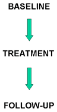
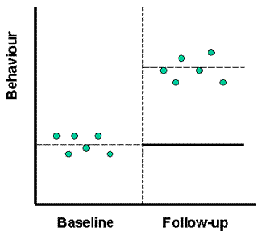
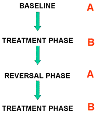
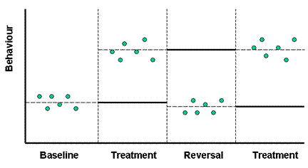
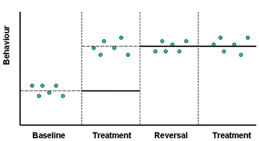
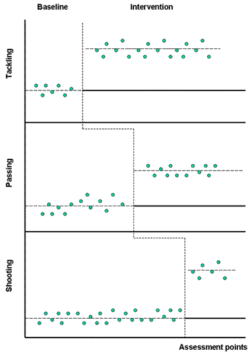
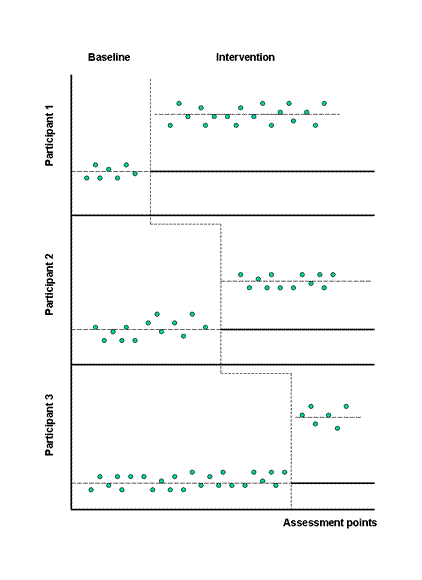
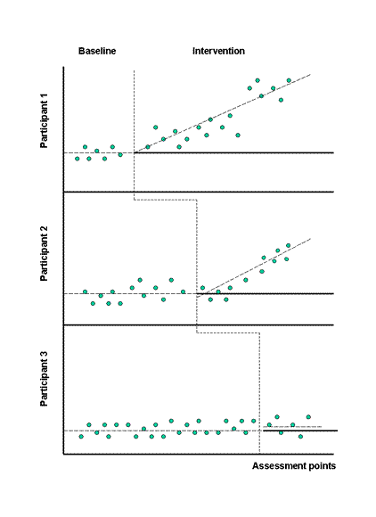
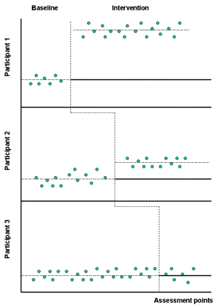
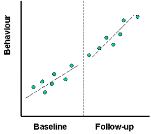

在应用行为分析领域最初开发了单案例实验设计作为传统组设计的替代品，评估临床和应用研究中的治疗效果。典型的早期应用是研究行为矫正措施的效果，例如在学习困难的人群中使用强化时间表为。此后，他们被广泛应用于各种其他研究领域，包括体育和运动科学。这些设计原则上可以用来评估心理上还是生理上任何种类的变化。然而，他们最常用的用途是确定改变特定可观察行为的治疗效果。例如，在我们自己的领域，可能会改变训练方法，运动表现，坚持锻炼计划等等。因此，我将在行为变化的背景下讨论单案例设计，但要记住，行为变化不一定是使用这些设计可以检验的唯一因变量。例如，一名前SSHES学生在他的最后一年的项目中使用了一个单案例设计来评估在高海拔地区各种生理参数的变化。

## 优势 **Some advantages**

与组设计相比，单一案例设计具有两大优势。首先，从实际角度来看，他们需要的参与者较少，因此更容易进行。其次，更重要的是，它们是具体到人(**idiographic**)的，可以深入研究干预措施对个人的影响。在一个典型的通用（组）设计中，比如随机前测后测对照组的设计，我们对参与者进行干预的结果进行平均，并通过确定这些组之间是否存在统计学显着差异来评估其效果。这就存在了两个主要问题。

首先，干预可能会对一些参与者产生很大的影响，但对其他参与者的影响甚至不大，甚至完全没有影响。平均效应忽略干预对参与者个体的影响。其次，当干预对参与者有不同的影响时，我们最终会得到很大的组内差异。从你的统计训练你应该认识到，如果组间变化低于组内变化，即使干预对接受它的个体有效果，我们的测试也不能检测到统计学上显着的效应。因此，当实际上治疗具有实际或临床意义时，通式设计可能不会发现统计学显着的效果。

或者，如果样本量足够大，我们可能会发现一个具有很小实际意义的治疗的统计学显着效果。例如，假设我们进行了一项小组研究来评估新的饮食习惯对严重肥胖人群体重的影响。我们选择体重超过120KG的参与者，我们发现，在干预之后，治疗组平均失去300g。对照组体重没有变化。如果我们的样本量足够大，我们可以发现这种差异具有统计显着性，但显然它没有什么实际或临床意义。对于二十石以上的人来说，减掉300g对他们的生命或健康没有明显的影响。

## **基本原则 Fundamental principles**

单案例设计的目的是证明治疗导致了任何可观察到的行为变化，而不是其他因素。因此，这些设计的一个主要问题，就像对于组设计一样，它们应该具有较高的内部效度，并且表现出治疗的因果效应。请记住，内部效度关系到研究设计使我们能够将因变量的变化归因于独立变量（干预）的操纵，而不是其他因素。所以我们必须排除成熟，历史，选择等威胁的有效性。在小组设计中，我们通过比较治疗组和未接受治疗的对照组来做到这一点。在单案例设计中，我们没有一个没有处理的小组。但是，每个参与者都有一个没有治疗的条件。也就是说，我们可以比较参与者在治疗前和治疗后的行为。换句话说，每个参与者都是自己的控制组。

案例设计的逻辑非常简单。关键原则或标准是当且仅当在应用治疗时观察到行为改变时，获得治疗效果的证据。换句话说，行为的改变必须与实施治疗相一致。如果确实如此，并且这样做是重复的，那么观察到的变化不太可能是由于其他因素造成的，我们至少可以合理地确信治疗是有效的。

这个标准只是表达我们在第五课中遇到的两个同时提出的命题的另一种方式，这个命题必须被实现，以确定它确实是X导致Y而不是别的：

If X, then Y  和         If not X, then not Y

**当且仅当在应用治疗时观察到行为改变时，才能获得治疗功效的证据。**

那么，一个非常基本的单例设计将如下所示：

我们获得了一个我们想要改变的行为的基线测量，实施治疗，然后后续测量，看看行为是否已经改变。 统计检验可用于检查变化是否具有统计显着性，但是，这些变化超出了本课的范围。 通常在单案例设计中，检查效果的主要方法是通过视觉检查：我们对数据进行绘制并查看是否存在明显变化。 发生变化的例子看起来像这样：

行为已经在基线评估了六个点，每个点都由一个绿点表示。 然后介绍干预，用垂直虚线表示。 随后又进行了六次行为评估。水平线断开代表基线和后续行为的平均水平。 实线表示如果干预措施没有效果，在随访期间将观察到的行为水平。

这里的视觉检查表现出明显的行为变化。 但是，这样一个简单的设计不一定会让我们排除变化的替代解释。 这将类似于使用预实验，单组，预测试后测试设计。 任何数量的因素都可能与治疗期一致，并导致观察到的变化。 这种设计不能完全符合上面给出的关键标准。 也就是说，我们可以看到，行为的变化发生，如果和当时的治疗是应用（如果X，然后Y），而不仅是当（如果不是X，那么不Y）。 我们不知道如果我们没有实施治疗，会发生什么。 但无论如何，我们本可以得到观察到的变化。

## **ABAB设计 ABAB (Reversal) designs**

为了满足这个关键标准，最早加强单案例设计的尝试被称为ABAB或逆向设计：

这里我们得到我们的基准测量（A），然后引入处理（B）。 只有当引入治疗（如果X，然后是Y），我们正在寻找行为的变化。 然后我们进入逆转阶段（A）；治疗被删除，我们正在寻找行为返回到基准水平（如果不是X，那么不是Y）。 最后，我们重新引入治疗（B），看看行为是否再次改变（如果X，那么Y）。 以下是治疗成功的假设例子：

在这里，实线表示如果前一个阶段没有效果将会存在的行为水平。 我们可以看到，当治疗被引入时，行为增加，当治疗被移除时返回到基线，并且当重新引入治疗时，再次增加。

这种设计符合我们显示治疗效果的关键标准。 当且仅当治疗到位时，我们观察变化。 有效性的威胁（例如成熟）几乎不可能与引入治疗正好吻合，而是在治疗被移除的地方停止使用，然后与重新引入治疗一致。 因此，我们可以得出结论，这是导致行为改变的治疗。

想象一下，当绘制结果看起来像这样：

我们现在不满足这个关键标准，因为只有当治疗有效时，行为才会有所改变。 因此，我们不得不得出这样的结论，要么是别的什么造成了这种变化，要么是因为治疗而导致的任何变化都是不可逆转的。

所以，ABAB设计的内部效度很强。 但是，前面的例子说明了一个明显的缺点。 这就是说，他们要求治疗的效果在实施时才显而易见。 显然，在现实生活中，我们希望我们的干预措施具有更持久的效果。  因此，在现实世界中，我们很可能得到类似于最后一组的结果：引入治疗导致（相对）永久性的行为改变。 既然我们现在还没有一种情况，行为只是在治疗的时候才会发生变化，我们不能得出任何确凿的因果推论。 再次，成熟的有效性威胁可能与引入治疗相吻合。

## **多基线设计 Multiple baseline designs**

多基线设计是单案例方法的更复杂的应用，避免了在ABAB设计中需要扭转处理效果的问题。 这里介绍的干预效果是通过在不同的时间点把它引入到不同的基线来证明的。 如果每个基线变化，当且仅当它是干预的目标时，那么效应可以归因于干预而不归因于其他因素。

有多种不同类型的多基线设计。 最常用的是跨行为的多个基线和跨参与者的多个基线。

### **跨行为的多基线 Multiple baselines across behaviours**

通过跨行为的多个基线，治疗被相继引入不同的行为。 例如，我们可能要评估一个意象训练(imagery training)计划对运动的不同方面的影响，比如说在足球或曲棍球上的对手，传球和射门。 基线是针对每个行为建立的，然后将干预分别应用于每个行为，一次一个。 如果成功，结果将如下所示：

每个行为都是针对性的，我们可以看到我们的关键标准已经得到满足：当且仅当应用干预时，行为才会发生变化。

多基线设计要求基线是独立的。 这意味着治疗的效果不能推广到非目标行为。 例如，在这个例子中的表演者可能会开始使用意象来加强他们的传球和射门，而这些行为是专门针对目标的。 如果治疗的效果影响一个行为之前的目标，那么我们在一个变化之前看到它发生，我们不会满足当时的行为改变的关键标准，当只有当治疗是适用的。 这是跨行为设计的多个基线的严重限制，因为有效的治疗很可能推广到非目标性能方面。 例如，我们的参与者可能会觉得意象正在帮助他们解决问题，所以他们自发地开始将其应用到游戏的其他方面。

### **跨参与者的多个基线 Multiple baselines across participants**

跨参与者的多基线不太可能被基线的非独立性困扰。 这里的基线是个人，依次对每个人进行治疗。 如果不允许参与者讨论彼此的干预，或者看到其他人在干什么，那么基线应该保持独立。 以下是涉及三个人的参与者研究的多个基准的结果：

正如你所看到的，我们的关键标准在这里得到满足。 当且仅当每个人的行为被定位时，行为才会改变。 在三个不同的人身上，由于除干预之外的其他因素，恰恰在同一时间应用这种治疗方法，同样的行为也不太可能发生改变。 因此，还有其他解释的假设是不合理的，我们可以确信，干预是有效的。

## **行为评估 Behavioural assessment**

在单案例设计中，可观察到的行为是因变量，对行为进行有效可靠的评估显然是重要的。 通常情况下，这将涉及培训至少两名观察员按照特定的标准对行为进行评分，直到他们达到预先确定的评分人间可靠性水平（见第四课：测量）。

## 更多优势 **More advantages**

我们已经讨论了单案例设计的具体性质如何使我们能够避免组设计中的组内变化问题。进一步的优势在于能够深入检查干预措施的效果。例如，这些设计可以很容易地用来查看具体的干预，以确定其活性成分或提高其功效。有些干预措施相当复杂，涉及很多方面。这可能是其中一些方面的工作，而其他方面是无效的。使用单案例设计，我们可以梳理干预的不同方面，并单独或以各种组合的方式应用这些方面，以找出最佳的方法。我们也可以尝试改变干预措施或增加新的程序或技术，以提高其有效性。不同的治疗也可以相互比较，看哪个是最好的。

单案例设计方法提供了许多机会，仔细检查和操纵干预，以了解正在发生什么以及如何改进。例如，考虑以下跨参与者研究中多个基线的结果模式：

在这里很明显，治疗的效果不会立即出现，而是需要一段时间才能开始，也许是因为个人需要在新的治疗方法产生效果之前进行锻炼。 因此，参与者三缺乏变化可能是因为后续评估没有延续足够长的时间来显示任何变化。 这样的结果模式可能会导致我们试图加强干预，使其更加直接的影响。

## 局限 **Limitations**

单病例设计的一个主要问题是，为了对干预的有效性有信心，我们需要多少次来证明一个效果？ 跨参与者多基线设计中三个参与者？ 五个？十个？ 这个问题没有答案。 另一方面是我们可以忍受多少无效的影响，并仍然有信心干预？ 考虑以下结果：

看来，治疗对参与者1有很大的影响，对参与者2影响很小，对参与者3没有影响。 我们应该从中得出什么结论呢？ 这是一个很困难的问题。 然而，我们从这样图中可以得到信息，并引导我们进一步研究重要的问题。 这里的一个显而易见的问题是试图确定是什么导致了参与者1的反应，以及/或者是什么导致参与者3没有反应。 换句话说，我们可以探索个人客户特征如何与治疗相互作用，这可能导致我们开发新的或更有效的治疗。

另一个不确定性问题出现在基准阶段期望的方向有变化的趋势。 考虑这些结果：

在基线阶段，这些趋势表现出增加的趋势。这并不罕见，可能是由于对行为的熟悉程度或练习日益增加，特别是对于参与者而言，这是一种新的行为。问题是，干预结果之后观察到的增加是干预的结果，还是只是延续了一个本来可能发生的趋势？但是请注意，这里的跟踪趋势比基线更陡峭。幸运的是，可以应用统计技术来确定趋势的变化是否显著。

这种单案设计的问题让我想起了童谣里的小女孩：当她好的时候，她非常好，但当她坏的时候，她很可怕。同样，当干预明显而一致地有效时，这些设计显示得非常清楚；当干预的影响不是那么清晰或者一致时，对结果的解释可能是可怕的！

另一个限制涉及非特定的治疗效果，特别是注意力效应，参与者对实验情况的效益和需求特征的期望（参见第六课）。由于研究人员和参与者之间通常涉及很多联系，而且研究人员寻找的内容通常非常明显，所以单案设计可能特别容易出现这样的问题。

最后一个问题是外部有效性或泛化的问题：我们可以在多大程度上将研究结果推广到其他人或情况？这个问题也没有真正的答案。但是，这不是唯一的个案设计。从第六课中回顾研究的有效性，从逻辑上说，我们决不能将研究结果推广到所涉及的特定参与者以及研究发生的背景或情境之外。尽管如此，我们可能对涉及许多参与者的团队设计的结论的普遍性更加信任，而不是仅涉及少数参与者的单案例设计。

## **Conclusion**

单案例设计是一种可供选择的研究方法，用于检验具体而又定量的干预措施的有效性。 因此，我们对定性研究方法获得了一些丰富和深入的理解，同时能够量化变化并对数据及其解释保持相对客观的立场

